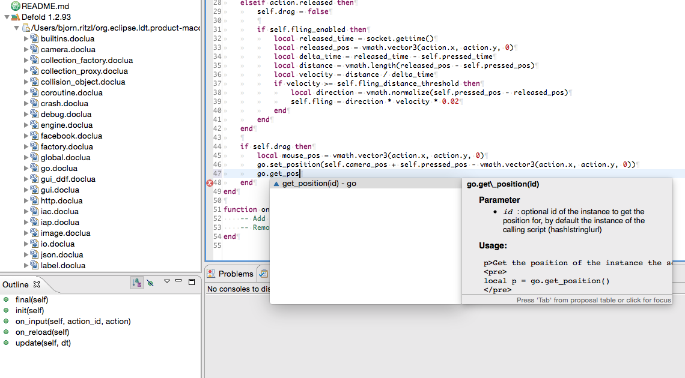

# Defold LDT
Defold LDT is an [Execution Environment](http://wiki.eclipse.org/LDT/User_Area/Execution_Environment_file_format) for [LDT](https://eclipse.org/ldt/) with support for the [Defold game engine](http://www.defold.com) APIs.

## Installation
Download [defold-ldt.zip](https://github.com/britzl/defold-ldt/blob/master/defold-ldt.zip) and add it using [the following instructions](http://help.eclipse.org/kepler/topic/org.eclipse.koneki.ldt.doc.user/help/Koneki/LDT/Developer_Area/User_Guides/User_Guide_1.0/Tasks.html?cp=35_3_1#Managing_Execution_Environments). Remember to remove any existing Lua EE from the build path as well!

## Updating the Execution Environment
You can create a new Execution Environment from the current Defold documentation by running:

	./create.py

This will download the reference documentation for the latest stable version of Defold and convert it into the proper format for import into LDT.